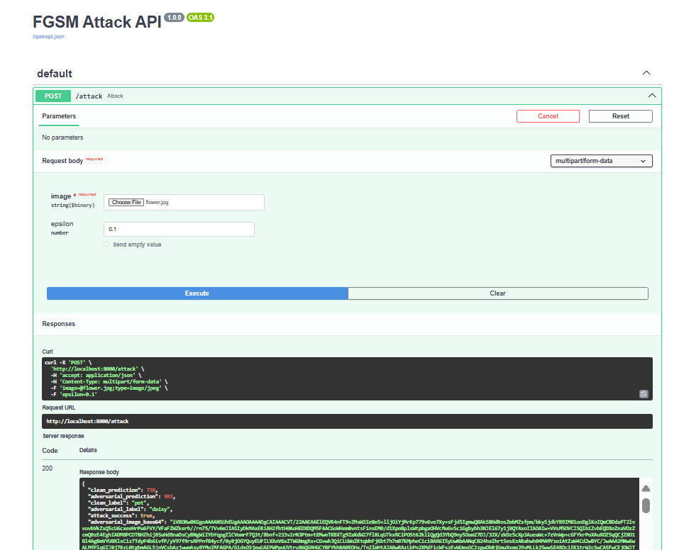
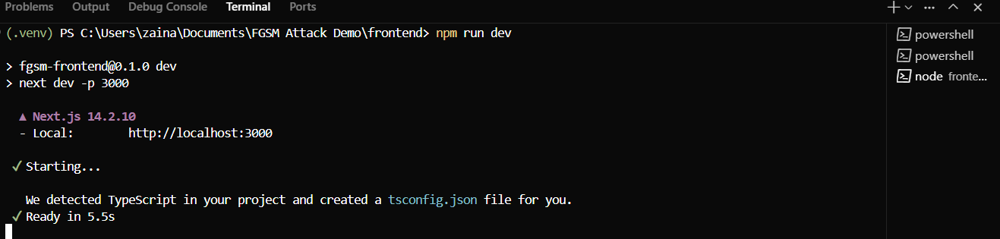
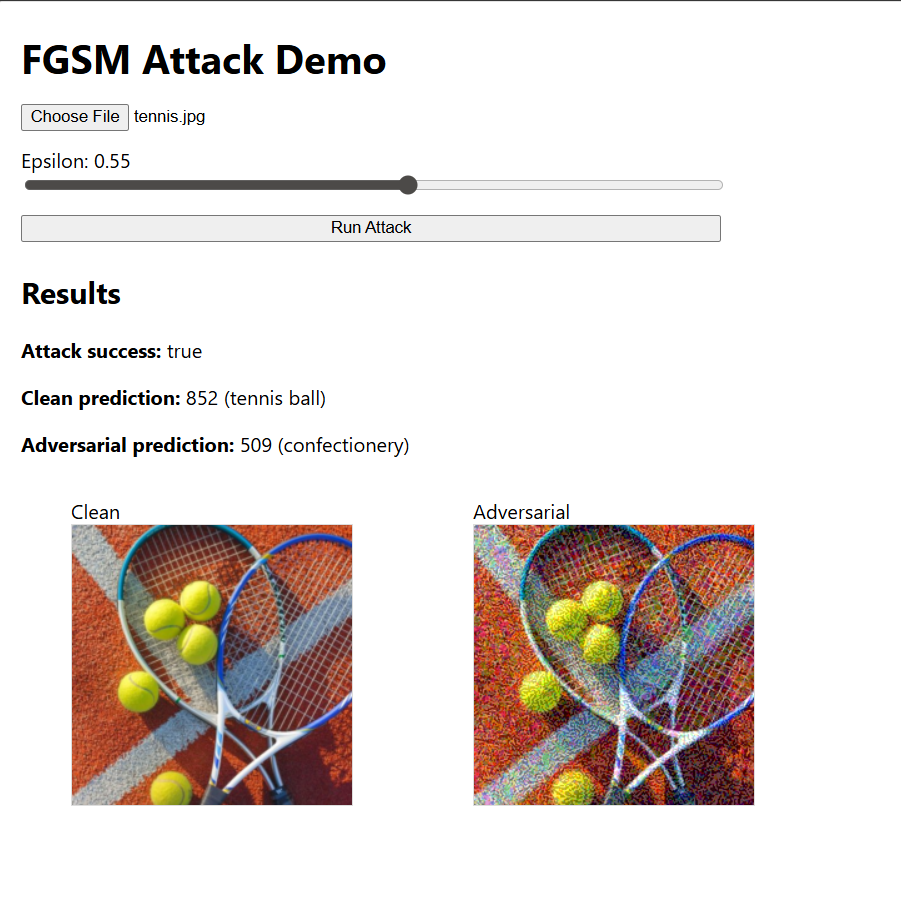
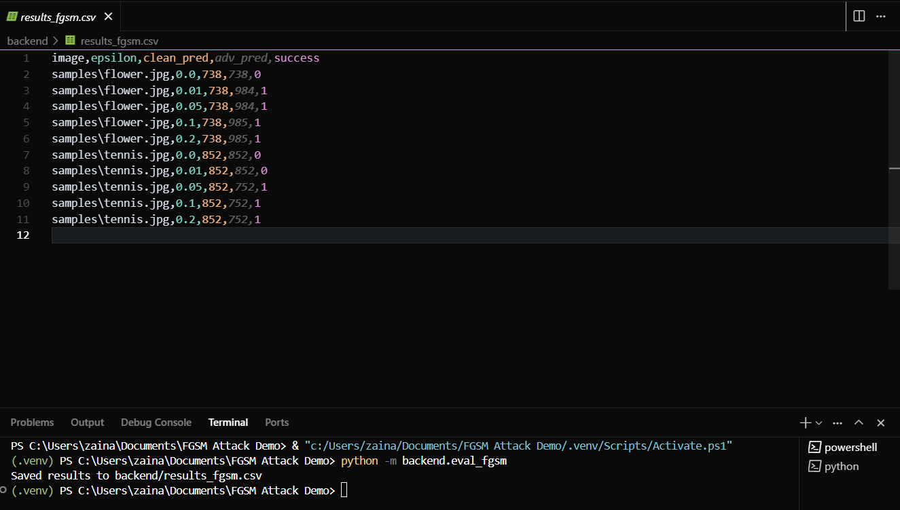

This repository contains a minimal FastAPI backend implementing the FGSM adversarial attack using PyTorch and a Next.js frontend to demo the attack on uploaded images.

### Deployed URLs (fill in after deploy)
- Backend API: https://fgsmbackend.onrender.com
- API Docs: https://fgsmbackend.onrender.com/docs#/
- Frontend App: https://fgsmfrontend-serb.onrender.com/

### Prerequisites
- Python 3.10+ (recommended)
- Node.js 18+

### Backend: Run Locally
1. Create and activate a virtual environment.
2. Install dependencies:
```
pip install -r backend/requirements.txt
```
3. Start the API:
```
python -m uvicorn backend.app_fgsm:app --reload --host 127.0.0.1 --port 8000
```
Then open http://localhost:8000/docs
4. Test with curl:
```
curl -X POST "http://localhost:8000/attack" \
  -F "epsilon=0.1" \
  -F "image=@path/to/image.jpg"
```

### API Specification
- Endpoint: `POST /attack`
- Request (multipart/form-data):
  - `image`: PNG/JPEG file (required)
  - `epsilon`: float, default 0.1 
- Response (JSON):
  - `clean_prediction`: int label index
  - `adversarial_prediction`: int label index
  - `attack_success`: boolean
  - `adversarial_image_base64`: base64 PNG of adversarial image
  - Extras returned for convenience: `clean_image_base64`, `clean_label`, `adversarial_label`, `epsilon`

### Frontend: Run Locally
1. Navigate to `frontend/` and install dependencies:
```
cd frontend
npm install
```
2. Set the API URL (create `.env.local`):
```
NEXT_PUBLIC_API_URL=http://localhost:8000
```
3. Start the dev server:
```
npm run dev
```
4. Open the app: `http://localhost:3000`

### FGSM
Fast Gradient Sign Method perturbs an input in the direction that maximally increases the model's loss, using the sign of the gradient with respect to the input. Given an input x and label y, and loss L(θ, x, y), FGSM forms `x_adv = x + ε * sign(∇_x L(θ, x, y))`. With small ε, the image looks visually unchanged to humans, yet can cause misclassification. Increasing ε typically increases attack success but can introduce visible artifacts.

### Evaluation and Observations

From the included run on two images (`samples/flower.jpg`, `samples/tennis.jpg`):
- Success rate vs ε (success = adversarial prediction differs from clean):

  | ε | success / 2 |
  |---|-------------|
  | 0.00 | 0/2 |
  | 0.01 | 1/2 |
  | 0.05 | 2/2 |
  | 0.10 | 2/2 |
  | 0.20 | 2/2 |

- Per‑image changes:
  - `flower.jpg`: 738 → 984 (ε=0.01/0.05), then 738 → 985 (ε≥0.1).
  - `tennis.jpg`: 852 → 752 starting at ε=0.05 (no change at ε=0.01).

Takeaways:
- Increasing ε strengthened the attack: no successes at ε=0.00, partial at ε=0.01, and consistent at ε≥0.05 for both images.
- Different images have different sensitivity: `flower.jpg` flips at ε=0.01, `tennis.jpg` needs ε≥0.05.
- Visual changes remain small at ε≈0.05–0.10 but are typically sufficient to alter the prediction.

The raw results used for this summary are in `backend/results_fgsm.csv`.

### Screenshots
Backend



Frontend



Evaluation


### Deployment (Render)
Backend (Web Service)
- Build Command: `pip install -r backend/requirements.txt`
- Start Command: `uvicorn backend.app_fgsm:app --host 0.0.0.0 --port $PORT`
- Env vars: `PYTHON_VERSION=3.11.9`

Frontend (Static Site)
- Root Directory: `frontend`
- Build Command: `npm ci --include=dev && npm run build`
- Publish Directory: `out`
- Env vars: `NEXT_PUBLIC_API_URL=https://fgsmbackend.onrender.com`, `NODE_VERSION=18.18.2`

Notes
- If the backend idles, the first request may be slow; retry once.
- CORS is restricted to the frontend Render URL and localhost in `backend/app_fgsm.py`.

References
- PyTorch FGSM tutorial: https://docs.pytorch.org/tutorials/beginner/fgsm_tutorial.html
- Goodfellow et al., "Explaining and Harnessing Adversarial Examples": https://arxiv.org/abs/1412.6572